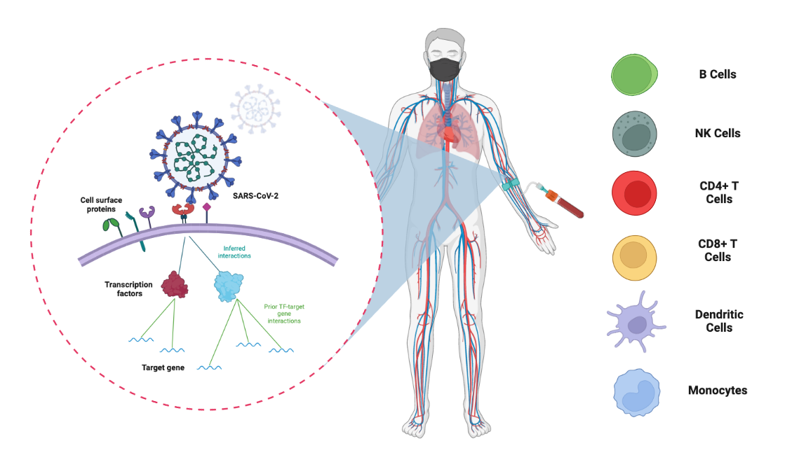

# COVID-19db of Immune Cell States 
### A comprehensive web resource linking surface proteins to transcription factors to delineate cellular heterogeneity of host response during SARS-CoV-2 infection

https://covid19db.streamlit.app/

